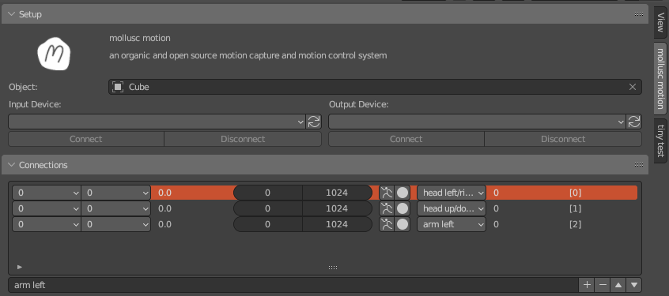

# 'mollusc motion' Blender Add-on
*an organic and open source motion capture and motion control system*

The add-on is made to:

1. **Read data from a microcontroller** (e.g. an Arduino)
2. **Record** this data in [Blender](http://blender.org), edit it, etc.
3. **Control servos, stepper motors** or other actuators by sending the recorded data (or the live-data, *pass-through*) to a second microcontroller

..of course you don't have to record data, you can also draw your animation curves like you would animate a 3D object to control physical servos and motors.

The Add-on is found on the right side in Blender's **Graph-Editor**:

## Applications

Applications can be:

* animatronics, making puppets move
* camera motion control
* stop motion animation
* recording real world data (e.g. a light, temperature, humidity sensors) to blender with only 1 fps
* *...and many more!*

## Connect to the input device

We use our [Spaghettimonster Firmware](https://github.com/clockdiv/Spaghettimonster) for this purpose.

The serial data you send from the Arduino (or any other microcontroller) can be either a csv-String or as a json-String. Make sure to end it with `\n`. Examples:

* As csv, it's the Spaghettimonster ID following six values from sensors. The six values are hard-coded and mandatory at the moment. `Serial.printf("1,0.503225,0.521750,0.214153,0.522978,0.133823,0.000000,2,0.535541,0.536594,0.500000,0.538680,0.543106,0.748236\n");`
* As json, it looks like this: `Serial.printf("{\"1\":\"(0.503225,0.521750,0.214153,0.522978,0.133823,0.000000)\",\"2\":\"(0.535541,0.536594,0.500000,0.538680,0.543106,0.748236)\",\"3\":\"(0.533928,0.523421,0.524241,0.496456,0.532858,0.000000)\"}\n");`

## Record and map the data

## Connect to the output device

We use our mollusc motion board for this purpose. It's a custom pcb with a Teensy 4.0 microcontroller that (at the moment) can connect to three stepper motors and a couple of Dynamixel servos. 

